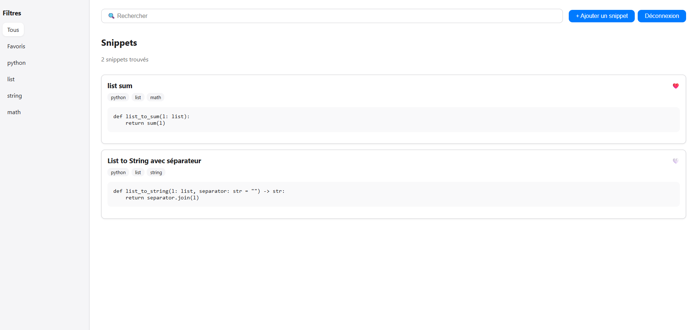

# Grabbit 🐇 – Code Snippet Manager for Developers

Grabbit is a clean and fast web app to store, tag, search, and retrieve your favorite code snippets — no backend required. Built with React + TypeScript, using Firebase for authentication and storage, and deployed via GitHub Pages.

## ✨ Features

- 🔐 **Authentication** – Secure login/signup with Firebase Auth
- 🏷️ **Dynamic Tagging** – Add custom tags, stored per user
- 🔍 **Search** – Filter by title or tags (starting from 3 characters)
- ❤️ **Favorites** – Mark snippets with a heart and filter by favorites
- 📱 **Responsive** – Clean UI optimized for desktop and mobile
- ☁️ **Serverless** – Uses Firebase Firestore, no backend server needed

## 🚀 Live Demo

👉 [Grabbit](https://floriandaunay.github.io/Grabbit/#/login)
